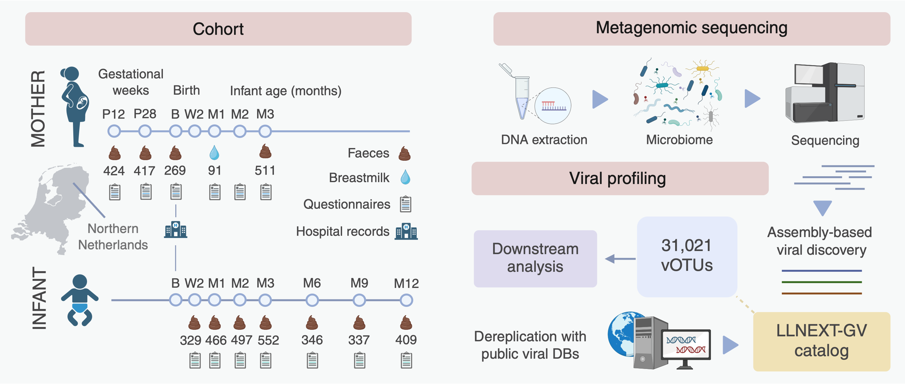

# Pregnancy and Early-Life Gut Virome in the LLNEXT Cohort  
## Origin, Persistence, Influencing Factors, and Health Implications  

Gut virome analysis from metagenomic data in the **Lifelines NEXT (LLNEXT)** mother–infant cohort.

  

---

## Overview
Here, we present a comprehensive **characterization of early-life gut virome assembly alongside maternal gut viral dynamics during pregnancy**. 
- 🧬 **Large-scale virome profiling:** We analyzed the DNA virome from 4,523 fecal and 91 breastmilk metagenomes across 714 mother–infant pairs in the Lifelines NEXT cohort, generating a catalog of >31,000 viral operational taxonomic units (vOTUs).
- 🌱 **Contrasting virome dynamics:** The maternal gut virome is highly stable over time, whereas the infant gut virome undergoes rapid diversification during early life.
- 🚼 **Drivers of infant virome development:** Delivery mode and feeding mode are the primary determinants of infant virome developmental trajectories, with additional influences from maternal parity (presence of siblings).
- 🦠 **Virome and health outcomes:** Increased viral diversity in infancy is associated with the development of food allergy.
- 🔗 **Maternal origin of the infant virome:** Strain-level analyses identify the maternal gut as the dominant source of infant gut viruses (with reduced viral sharing following cesarean delivery) and lower sharing detected from breastmilk.
- 🛡️ **Genetic determinants of persistence:** The presence of DNA adenine N6-methyltransferase *hin1523* and diversity-generating retroelements promotes long-term viral persistence in the infant gut.

Together, these findings define the origin, dynamics, and modulating factors of the infant gut virome and uncover genetic strategies that support viral persistence in the gut ecosystem.

---

## Table of Contents
- [Cohort & Study Design](#cohort--study-design)
- [Methods](#methods)
  - [Viral Detection](#viral-detection)
  - [Contig Extension & Filtering](#contig-extension--filtering)
  - [Quality Control & Host Removal](#quality-control--host-removal)
  - [Dereplication & Abundance Estimation](#dereplication--abundance-estimation)
- [Data Availability](#data-availability)
- [Code Structure](#code-structure)
- [Citation](#citation)

---

## Cohort & Study Design

This study is based on the **Lifelines NEXT (LLNEXT)** cohort, a large, prospective, population-based birth cohort in the Netherlands designed to investigate early-life determinants of health and disease.

- **Cohort overview:**  
  https://umcgresearch.org/w/lifelines-next

- **Data catalogue and access information:**  
  https://umcgresearchdatacatalogue.nl/all/cohorts/LIFELINES_NEXT

- **Original cohort description:**  
  https://pubmed.ncbi.nlm.nih.gov/32100173/

### Study Design

The Lifelines NEXT cohort follows mothers from pregnancy and their children from birth onward, with extensive longitudinal sampling and deep phenotyping.

**Key design features relevant to this study include:**
- 🤰 Maternal stool sampling during pregnancy  
- 👶 Longitudinal infant stool sampling during early life  
- 🍼 Breastmilk sampling in a subset of mothers  
- 📊 Shotgun metagenomic sequencing of fecal and breastmilk samples  
- 📋 Detailed metadata covering clinical, perinatal, environmental, and socioeconomic factors  

This design enables high-resolution investigation of maternal–infant virome transmission, early-life virome development, and factors influencing viral persistence and health-associated outcomes.

---

## Methods

### Viral Detection
We used multiple complementary tools to identify viral sequences from assembled contigs:
- **VirSorter2**, **DeepVirFinder**, and **geNomad** for initial viral prediction.

### Contig Extension & Filtering
- Predicted viral contigs were extended using **COBRA**.
- Bacterial regions in prophages were trimmed using **geNomad** filters.

### Quality Control & Host Removal
- **CheckV** was used to:
  - Estimate genome completeness.
  - Remove host contamination from prophages.
  - Exclude sequences with ≤50% completeness.

### Dereplication & Abundance Estimation
- Viral sequences were dereplicated:
  - (A) Internally within the dataset.
  - (B) Against public viral genome databases.
- Viral abundance was estimated by mapping reads back to the dereplicated viral genome set.

---

## Data Availability
All resulting viral genome sets, abundance tables, and associated metadata will be made available through:
- [Zenodo DOI link (coming soon)](https://zenodo.org/)
- Lifelines (to be added)

---

## Code Structure
Scripts and workflows used in this project are organized as follows:

---

## Citation

